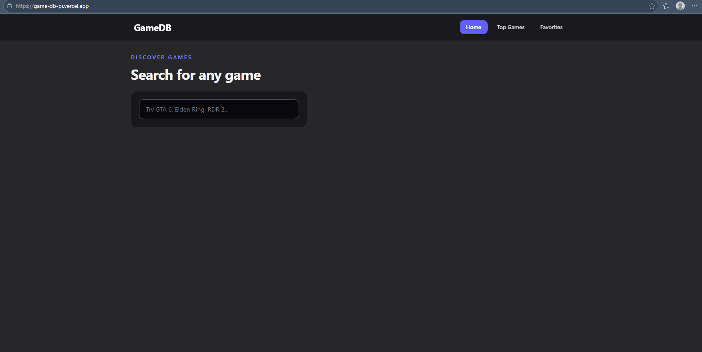

# GameDB

A React SPA gaming database powered by the IGDB API.

---

## Description

GameDB allows you to search for any game, explore top-rated titles from the last decade, view detailed game info including genres, platforms, release date, storyline and similar games. You can also save your favourite games locally.

---

## Demo

> Live: [GameDB](https://game-db-pi.vercel.app/)

---

## Tech Stack

- **React** — UI
- **React Router** — client-side routing
- **Tailwind CSS** — styling
- **Vite** — build tool
- **IGDB API** — game data
- **Vercel** — deployment & serverless API

---

## Getting Started

### Requirements

- Node.js >= 20
- A [Twitch Developer] account to obtain IGDB API credentials

### Environment Variables

Create a `.env.local` file in the root of the project:

```env
CLIENT_ID=your_twitch_client_id
CLIENT_SECRET=your_twitch_client_secret
```

### Commands

```bash
# Install dependencies
npm install

# Run locally (requires Vercel CLI)
vercel dev --listen 3001

# Build for production
npm run build
```

---

## Links

- Author: Roman Ivashkevych
- [GitHub](https://github.com/devashkevych)
- [LinkedIn](https://www.linkedin.com/in/roman-ivashkevych-a77388239/)
